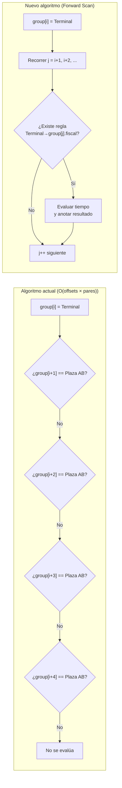
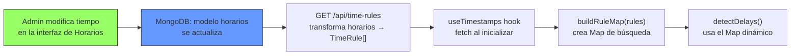
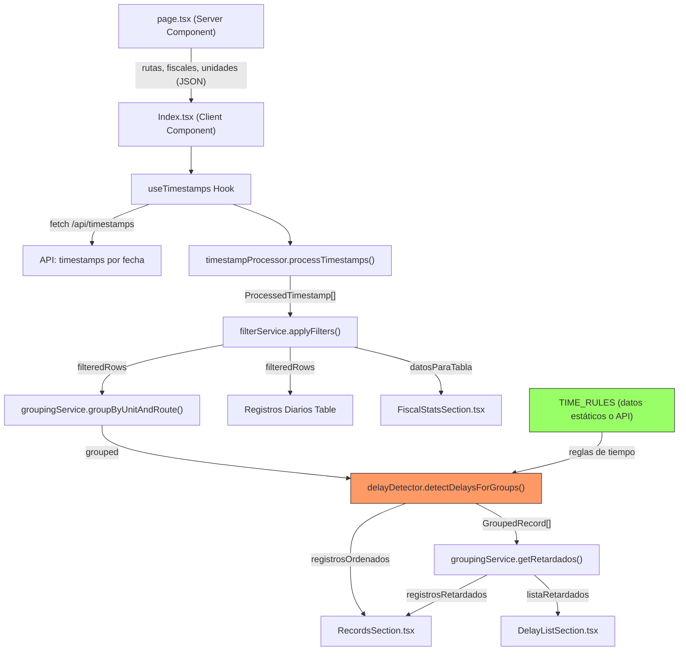

# Reestructuración de la Lógica de Procesamiento — `busqrcode-cordero-web`

## Contexto del problema

El archivo [Index.tsx](file:///c:/Users/USUARIO/Desktop/proyectos/busqrcode/cordero/busqrcode-cordero-web/components/pages/Index.tsx) tiene **1685 líneas** que concentran:

1. **Transformación de datos crudos** → formato presentable (resolución de IDs, formateo de fechas/horas)
2. **Filtrado de datos** por fecha, unidad, ruta y fiscal
3. **Algoritmo de detección de retardados** (~570 líneas de `if` repetitivos, L546-L1115)
4. **Lógica de exportación** a imagen/PDF
5. **Renderizado UI** (tablas, filtros, cards)

### Problemas principales del algoritmo de retardados

El algoritmo actual (función `compareTimestamps`) usa bloques `if` hardcodeados para **cada combinación** de:
- Punto de origen (`Terminal`, `R1R2`, `Central Cordero`)
- Punto de destino (`Confitería el Loro`, `Dorsay`, `Biblioteca`, etc.)
- Offset de posición en el grupo (`i+1`, `i+2`, `i+3`, `i+4`, `i+5`)

Cada bloque repite la misma lógica de comparación de tiempo variando solo el **tiempo límite** y el **offset**. Esto es difícil de mantener y escalar.

---

## Decisiones de Diseño (Basadas en Feedback)

> [!IMPORTANT]
> **1. Reestructuración de `horarios`**: Se ha decidido utilizar el modelo existente pero **reestructurarlo por completo**. El nuevo diseño permitirá almacenar el tiempo entre puntos de forma dinámica, vinculando específicamente la **Ruta + Fiscal Origen + Fiscal Destino**.
> 
> **2. Orden Dependiente de la Ruta**: El orden de los puntos fiscales NO es global, sino que **se define para cada ruta individualmente**. El algoritmo utilizará la configuración de la ruta para conocer la secuencia lógica de los puntos.
> 
> **3. Datos Dinámicos**: Confirmado que los datos actuales en MongoDB NO están actualizados. Se procederá a crear una estructura limpia que permita la carga dinámica de estos tiempos.
> 
> **4. Límite de Escaneo (n)**: El rango de búsqueda de retardados (los antiguos offsets `i+1` a `i+5`) será dinámico: de `i+1` hasta `i+n`, donde `n` es el número de puntos totales asignados a la ruta específica.

---

## Proposed Changes

### Componente 1: Capa de Tipos TypeScript

Reemplazar el uso extensivo de `any` con interfaces tipadas.

#### [NEW] [types/busqrcode.ts](file:///c:/Users/USUARIO/Desktop/proyectos/busqrcode/cordero/busqrcode-cordero-web/types/busqrcode.ts)

```typescript
// Tipos base del dominio
export interface Timestamp {
  _id: string;
  id_unidad: string;
  id_ruta: string;
  id_fiscal: string;
  timestamp_telefono: string;
  timestamp_salida: string | null;
  createdAt: string;
}

export interface Ruta {
  _id: string;
  nombre: string;
  fiscales: { fiscal_id: string; numero_ruta: string }[];
}

export interface Fiscal {
  _id: string;
  numero: string;
  ubicacion: string;
  sethora: boolean;
}

export interface Unidad {
  _id: string;
  placa: string;
  numero: number;
  nombre_conductor: string;
}

export interface Horario {
  _id: string;
  nombre: string;
  ruta_id: string;
  horas: HoraConfig[];
}

export interface HoraConfig {
  FiscalA_id: string;
  FiscalB_id: string;
  tiempo_entre: number;
}

// Tipos procesados para la UI
export interface ProcessedTimestamp {
  key: string;
  hora_date: string;
  hora_servidor: string;
  hora_telefono: string;
  unidad: number;
  ruta: string;
  fiscal: string;
}

export interface EnrichedTimestamp extends ProcessedTimestamp {
  hora_salida?: string;
  onTime?: boolean;
  onTimeText?: string;
  diff?: number;
  delay?: number;
}

export interface GroupedRecord {
  title: string;
  group: EnrichedTimestamp[];
}

export interface FiscalCount {
  Fiscal: string;
  cantidad: number;
}

// Mapa de tiempos: origen → destino → { tiempo, rutasOverride? }
export interface TimeRule {
  origen: string;       // nombre del fiscal origen
  destino: string;      // nombre del fiscal destino
  tiempoDefault: number; // tiempo máximo en minutos
  tiemposPorRuta?: Record<string, number>; // { "4/2 S": 77, "R6": 19, ... }
}
```

---

### Componente 2: Servicios de Utilidades de Tiempo

Extraer todas las funciones de formateo y comparación de tiempo.

#### [NEW] [services/timeUtils.ts](file:///c:/Users/USUARIO/Desktop/proyectos/busqrcode/cordero/busqrcode-cordero-web/services/timeUtils.ts)

Contendrá:
- `formatDate(dateString)` — formato `YYYY-MM-DD HH:MM AM/PM`
- `formatHour(dateString)` — formato `HH:MM AM/PM`
- `formatHour30secs(dateString)` — hora con -30 segundos
- `convertToMinutes(timeString)` — convierte `HH:MM AM/PM` → minutos
- `compareTimeDifference(time1, time2)` — diferencia absoluta en minutos
- `getTodayDate()` — fecha actual formateada

Estas funciones se duplican actualmente entre `Index.tsx` y `app/api/app/timestamp/route.ts`. Se comparten.

---

### Componente 3: Servicio de Procesamiento de Timestamps

#### [NEW] [services/timestampProcessor.ts](file:///c:/Users/USUARIO/Desktop/proyectos/busqrcode/cordero/busqrcode-cordero-web/services/timestampProcessor.ts)

**Responsabilidad**: Transformar timestamps crudos en `ProcessedTimestamp[]`.

```typescript
// Pseudocódigo
export function processTimestamps(
  rawTimestamps: Timestamp[],
  rutas: Ruta[],
  fiscales: Fiscal[],
  unidades: Unidad[]
): ProcessedTimestamp[] {
  // Crear lookup maps (O(1) por ID en vez de O(n) filter por cada timestamp)
  const rutaMap = new Map(rutas.map(r => [r._id, r]));
  const fiscalMap = new Map(fiscales.map(f => [f._id, f]));
  const unidadMap = new Map(unidades.map(u => [u._id, u]));
  
  return rawTimestamps.map(ts => {
    const ruta = rutaMap.get(ts.id_ruta);
    const fiscal = fiscalMap.get(ts.id_fiscal);
    const unidad = unidadMap.get(ts.id_unidad);
    // ... transformar
  });
}
```

**Mejora de rendimiento**: Actualmente usa `Array.filter()` para cada timestamp × cada entidad (O(n²)). Con `Map` será O(n).

---

### Componente 4: Servicio de Filtrado

#### [NEW] [services/filterService.ts](file:///c:/Users/USUARIO/Desktop/proyectos/busqrcode/cordero/busqrcode-cordero-web/services/filterService.ts)

**Responsabilidad**: Aplicar filtros de fecha, unidad, ruta, fiscal sobre los datos procesados.

```typescript
export interface FilterCriteria {
  fecha?: string;
  unidad?: number | null;
  ruta?: string | null;
  fiscal?: string | null;
}

export function applyFilters(
  timestamps: ProcessedTimestamp[],
  filters: FilterCriteria
): ProcessedTimestamp[] { ... }

export function getColumnsForContext(filters: FilterCriteria): Column[] { ... }
```

---

### Componente 5: Nuevo Algoritmo de Detección de Retardados (DATA-DRIVEN)

#### [NEW] [services/delayDetector.ts](file:///c:/Users/USUARIO/Desktop/proyectos/busqrcode/cordero/busqrcode-cordero-web/services/delayDetector.ts)

Este es el cambio más crítico. Reemplaza las **~570 líneas de `if`** con un algoritmo genérico basado en datos.

---

#### Análisis detallado del problema actual

El problema raíz es que **los puntos intermedios pueden no registrarse**, lo que desplaza la posición relativa del destino dentro del grupo. Veamos un ejemplo concreto:

**Ruta desde Terminal, orden de puntos esperado:**
```
Terminal → Confitería el Loro → Plazuela de Táriba → Plaza Andrés Bello
```

**Escenario A — Todos los puntos registrados (caso ideal):**
```
group[0] = Terminal            ← ORIGEN
group[1] = Confitería el Loro  ← comparar con group[0], tiempo <= 15 min
group[2] = Plazuela de Táriba  ← comparar con group[0], tiempo <= 40 min
group[3] = Plaza Andrés Bello  ← comparar con group[0], tiempo <= 70 min
```
Para comparar `Terminal → Plaza Andrés Bello` se usa `group[i + 3]`.

**Escenario B — Falta "Confitería el Loro":**
```
group[0] = Terminal            ← ORIGEN
group[1] = Plazuela de Táriba  ← comparar con group[0], tiempo <= 40 min
group[2] = Plaza Andrés Bello  ← comparar con group[0], tiempo <= 70 min
```
Ahora `Plaza Andrés Bello` está en `group[i + 2]`, no `i + 3`.

**Escenario C — Faltan dos puntos intermedios:**
```
group[0] = Terminal            ← ORIGEN
group[1] = Plaza Andrés Bello  ← comparar con group[0], tiempo <= 70 min
```
Ahora está en `group[i + 1]`.

**Lo que el código actual hace** para manejar esto es **un `if` para cada posible offset**:

```typescript
// ¿Está en i+1?
if (group[i]?.fiscal == "Terminal" && group[i + 1]?.fiscal == "Plaza Andrés Bello") { ... }
// ¿Está en i+2?
if (group[i]?.fiscal == "Terminal" && group[i + 2]?.fiscal == "Plaza Andrés Bello") { ... }
// ¿Está en i+3?
if (group[i]?.fiscal == "Terminal" && group[i + 3]?.fiscal == "Plaza Andrés Bello") { ... }
// ¿Está en i+4?
if (group[i]?.fiscal == "Terminal" && group[i + 4]?.fiscal == "Plaza Andrés Bello") { ... }
```

Esto produce un bloque **idéntico** repetido N veces (donde N = cantidad máxima de puntos intermedios + 1), para **cada par origen→destino**. Con ~15 pares y hasta 6 offsets cada uno = **~90 bloques `if`** de código repetitivo.

---

#### Diseño del nuevo algoritmo: **Forward Scan (Escaneo hacia adelante)**

La solución es **no necesitar saber en qué offset está el destino**. En vez de preguntar "¿está en `i+1`? ¿en `i+2`?", simplemente **recorrer hacia adelante desde el origen** buscando cualquier punto que tenga una regla definida:



**Implementación completa:**

```typescript
import { convertToMinutes } from './timeUtils';
import type { ProcessedTimestamp, EnrichedTimestamp, GroupedRecord } from '@/types/busqrcode';

// ═══════════════════════════════════════════════════════════════
// PARTE 1: INTERFAZ DE REGLAS
// ═══════════════════════════════════════════════════════════════

/**
 * Cada regla define: desde qué punto fiscal (origen), hasta qué punto
 * fiscal (destino), y cuántos minutos máximo debería tomar el trayecto.
 * 
 * Si el tiempo varía según la ruta, se especifica en `tiemposPorRuta`.
 * El `tiempoDefault` se usa cuando la ruta no tiene override específico.
 * Si `tiempoDefault` es 0, la regla SOLO aplica para las rutas listadas.
 *
 * IMPORTANTE: Las reglas NO se definen aquí en código. Se cargan
 * dinámicamente desde la API GET /api/time-rules, que las construye
 * a partir del modelo `horarios` en MongoDB. Esto permite que un
 * administrador modifique los tiempos entre puntos y las variaciones
 * por ruta sin necesidad de tocar código ni redeployar.
 */
export interface TimeRule {
  origen: string;       // nombre del fiscal origen (e.g. "Terminal")
  destino: string;      // nombre del fiscal destino (e.g. "Plaza Andrés Bello")
  tiempoDefault: number; // tiempo máximo en minutos (0 = solo aplica por ruta)
  tiemposPorRuta?: Record<string, number>; // { "4/2 S": 67, "R8": 48, ... }
}

// ═══════════════════════════════════════════════════════════════
// PARTE 2: MAPA DE BÚSQUEDA RÁPIDA
// ═══════════════════════════════════════════════════════════════

type RuleKey = `${string}→${string}`;

/**
 * Construye un Map<"origen→destino", TimeRule> para lookup O(1).
 * Se llama después de cargar las reglas desde la API.
 *
 * NO es una constante global — se reconstruye cada vez que
 * se cargan/actualizan las reglas desde la DB.
 */
export function buildRuleMap(rules: TimeRule[]): Map<RuleKey, TimeRule> {
  const map = new Map<RuleKey, TimeRule>();
  for (const rule of rules) {
    map.set(`${rule.origen}→${rule.destino}`, rule);
  }
  return map;
}

// ═══════════════════════════════════════════════════════════════
// PARTE 3: ALGORITMO — FORWARD SCAN
// ═══════════════════════════════════════════════════════════════

/**
 * Detecta retardados en UN grupo (una unidad en una ruta).
 *
 * CÓMO FUNCIONA:
 * 
 * Para cada registro en el grupo que sea un punto de ORIGEN conocido
 * (Terminal, R1R2, Central Cordero), el algoritmo escanea hacia
 * adelante buscando puntos de DESTINO que tengan una regla definida.
 * 
 * NO importa en qué posición relativa esté el destino (i+1, i+2, etc.)
 * porque el escaneo los encuentra todos automáticamente, sin importar
 * cuántos puntos intermedios estén presentes o ausentes.
 * 
 * EJEMPLO con ruta: Terminal → Conf. Loro → Plazuela → Plaza AB
 * 
 * Caso normal (todos los puntos registrados):
 *   group = [Terminal, Conf.Loro, Plazuela, PlazaAB]
 *   i=0 (Terminal): j=1 → Conf.Loro ✓ regla existe → evalúa
 *                   j=2 → Plazuela  ✓ regla existe → evalúa
 *                   j=3 → PlazaAB   ✓ regla existe → evalúa
 * 
 * Caso con punto faltante (sin Conf. Loro):
 *   group = [Terminal, Plazuela, PlazaAB]
 *   i=0 (Terminal): j=1 → Plazuela  ✓ regla existe → evalúa
 *                   j=2 → PlazaAB   ✓ regla existe → evalúa
 * 
 * Caso con 2 puntos faltantes:
 *   group = [Terminal, PlazaAB]
 *   i=0 (Terminal): j=1 → PlazaAB   ✓ regla existe → evalúa
 * 
 * → El MISMO código maneja todos los escenarios sin necesitar
 *   un if por cada offset posible.
 */
export function detectDelays(
  group: ProcessedTimestamp[],
  ruleMap: Map<RuleKey, TimeRule>,
  rutaNombre: string
): EnrichedTimestamp[] {
  const enriched = group.map(ts => ({ ...ts })) as EnrichedTimestamp[];

  for (let i = 0; i < enriched.length; i++) {
    const origen = enriched[i];

    // ── Escaneo hacia adelante ──
    // Desde la posición i+1 hasta el final del grupo,
    // buscar TODOS los puntos destino que tengan regla definida
    for (let j = i + 1; j < enriched.length; j++) {
      const destino = enriched[j];

      // 1. ¿Existe una regla para este par origen→destino?
      const ruleKey: RuleKey = `${origen.fiscal}→${destino.fiscal}`;
      const rule = ruleMap.get(ruleKey);
      if (!rule) continue; // No hay regla → saltar al siguiente j

      // 2. ¿Ya fue evaluado este destino por un origen anterior?
      //    (evita que un destino sea evaluado dos veces)
      if (destino.onTime !== undefined) continue;

      // 3. Determinar el tiempo máximo permitido para esta ruta
      const tiempoMax = rule.tiemposPorRuta?.[rutaNombre] ?? rule.tiempoDefault;
      if (tiempoMax === 0) continue; // Regla no aplica para esta ruta

      // 4. Calcular diferencia de tiempo
      const time1 = convertToMinutes(origen.hora_servidor);
      const time2 = convertToMinutes(destino.hora_telefono);
      const diff = time2 - time1;

      // 5. Anotar resultado en el destino
      destino.hora_salida = origen.hora_servidor;
      destino.onTime = diff <= tiempoMax;
      destino.onTimeText = diff <= tiempoMax ? "A tiempo" : "Retardado";
      destino.diff = diff;
      destino.delay = diff > tiempoMax ? diff - tiempoMax : 0;

      // NO break aquí → seguimos buscando más destinos adelante
      // porque un mismo origen (Terminal) puede tener reglas
      // hacia múltiples destinos (Conf.Loro, Plazuela, PlazaAB)
    }
  }

  return enriched;
}

/**
 * Aplica detectDelays a todos los grupos.
 * Cada grupo es una combinación unidad-ruta.
 */
export function detectDelaysForGroups(
  groups: GroupedRecord[],
  ruleMap: Map<RuleKey, TimeRule>
): GroupedRecord[] {
  return groups.map(record => {
    // Extraer nombre de la ruta del título del grupo ("23-4/2 S" → "4/2 S")
    const rutaNombre = record.title.split('-').slice(1).join('-');
    return {
      title: record.title,
      group: detectDelays(record.group, ruleMap, rutaNombre),
    };
  });
}
```

---

#### ¿Por qué esto elimina todos los `if` repetitivos?

Comparación directa del código actual vs. el nuevo:

**ANTES** — Necesita un `if` por cada offset posible (4 bloques para Terminal → Plaza AB):
```typescript
// Offset i+1 (faltan 2 puntos intermedios)
if (group[i]?.fiscal == "Terminal" && group[i + 1]?.fiscal == "Plaza Andrés Bello") {
  const diff = time2 - time1;
  const limit = group[i].ruta === "4/2 S" ? 67 : 70;
  group[i + 1].hora_salida = group[i].hora_servidor;
  group[i + 1].onTime = diff <= limit;
  // ... 4 líneas más idénticas
}
// Offset i+2 (falta 1 punto intermedio)
if (group[i]?.fiscal == "Terminal" && group[i + 2]?.fiscal == "Plaza Andrés Bello") {
  // ... misma lógica, solo cambia i+2
}
// Offset i+3 (todos los puntos registrados)
if (group[i]?.fiscal == "Terminal" && group[i + 3]?.fiscal == "Plaza Andrés Bello") {
  // ... misma lógica, solo cambia i+3
}
// Offset i+4 (por si acaso)
if (group[i]?.fiscal == "Terminal" && group[i + 4]?.fiscal == "Plaza Andrés Bello") {
  // ... misma lógica, solo cambia i+4
}
```

**DESPUÉS** — Una sola regla en el array + el forward scan lo encuentra automáticamente:
```typescript
// Solo esto en TIME_RULES:
{ origen: "Terminal", destino: "Plaza Andrés Bello", tiempoDefault: 70,
  tiemposPorRuta: { "4/2 S": 67 } },

// El loop `for (let j = i + 1; j < enriched.length; j++)` 
// encuentra "Plaza Andrés Bello" automáticamente sin importar 
// si está en j=i+1, i+2, i+3, i+4 o cualquier posición.
```

**Resultado**: ~570 líneas de `if` → ~15 objetos en `TIME_RULES` + ~30 líneas de algoritmo genérico.

---

#### Caso especial: múltiples destinos desde un mismo origen

El forward scan NO usa `break` después de encontrar un destino, porque un mismo origen puede tener reglas hacia múltiples destinos. Por ejemplo, desde `Terminal`:

```
Terminal → Confitería el Loro (15 min)
Terminal → Dorsay (23 min)
Terminal → Biblioteca (28 min)
Terminal → Plazuela de Táriba (40 min)
Terminal → Central Cordero (72 min)
Terminal → Plaza Andrés Bello (70 min)
```

Cuando el algoritmo está en `i=0` (Terminal), el loop interno `j` recorre todos los registros posteriores y **evalúa cada uno** contra la regla correspondiente, si existe:

```
j=1: Conf. Loro    → ruleMap["Terminal→Confitería el Loro"] = { tiempo: 15 } → EVALÚA
j=2: Plazuela      → ruleMap["Terminal→Plazuela de Táriba"] = { tiempo: 40 } → EVALÚA
j=3: Plaza AB      → ruleMap["Terminal→Plaza Andrés Bello"] = { tiempo: 70 } → EVALÚA
```

Cada destino se evalúa independientemente con su propio tiempo máximo.

---

#### Escalabilidad: agregar un nuevo punto fiscal

Si mañana se agrega un nuevo punto fiscal llamado "Puente Libertador" entre "Biblioteca" y "Plazuela de Táriba", con un tiempo de 33 minutos desde Terminal:

**ANTES**: Habría que agregar ~5 nuevos bloques `if` (uno por cada offset posible) Y actualizar los offsets de todos los puntos posteriores.

**DESPUÉS**: Solo agregar **una línea**:
```typescript
{ origen: "Terminal", destino: "Puente Libertador", tiempoDefault: 33 },
```
No hay que modificar nada más. El forward scan lo encontrará automáticamente.

---

### Componente 6: Servicio de Agrupación y Ordenamiento

#### [NEW] [services/groupingService.ts](file:///c:/Users/USUARIO/Desktop/proyectos/busqrcode/cordero/busqrcode-cordero-web/services/groupingService.ts)

```typescript
export function groupByUnitAndRoute(
  timestamps: ProcessedTimestamp[]
): Map<string, ProcessedTimestamp[]> { ... }

export function getRetardados(
  groups: GroupedRecord[]
): GroupedRecord[] { ... }

export function getListaRetardados(
  retardados: GroupedRecord[]
): EnrichedTimestamp[] { ... }

export function countByFiscal(
  timestamps: ProcessedTimestamp[]
): FiscalCount[] { ... }

export function getUniqueUnits(
  timestamps: ProcessedTimestamp[]
): number[] { ... }
```

---

### Componente 7: Servicio de Exportación PDF/Imagen

#### [NEW] [services/exportService.ts](file:///c:/Users/USUARIO/Desktop/proyectos/busqrcode/cordero/busqrcode-cordero-web/services/exportService.ts)

Extraer toda la lógica de `handleDownloadImage` y `handleDownloadAllRetardados` del componente.

---

### Componente 8: API Dinámica de Reglas de Tiempo (OBLIGATORIO)

> [!IMPORTANT]
> Este componente es **obligatorio**, no opcional. Es el que permite que las reglas de tiempo entre puntos se gestionen como **datos dinámicos en la DB** en vez de estar hardcodeadas en el código fuente.

#### [NEW] [app/api/time-rules/route.ts](file:///c:/Users/USUARIO/Desktop/proyectos/busqrcode/cordero/busqrcode-cordero-web/app/api/time-rules/route.ts)

Endpoint que transforma el nuevo modelo reestructurado en el formato `TimeRule[]` que consume el frontend.

**Diseño de la Reestructuración:**

Dado que se tiene "libertad total", el esquema sugerido para la API/DB es:
```typescript
// Estructura de respuesta de la API
export interface TimeRule {
  ruta_id: string;      // ID de la ruta específica
  origen_id: string;    // ID del fiscal origen
  destino_id: string;   // ID del fiscal destino
  tiempo_max: number;   // Tiempo en minutos
}
```

El endpoint GET hará el join necesario para que el frontend reciba un mapa optimizado de tiempos por ruta.

**PUT** para poblar los datos:
Permitirá enviar la configuración masiva de tiempos para cada ruta, facilitando la actualización de los datos que actualmente no son válidos en la DB.

**PUT** para actualizar reglas desde admin (modificar tiempos entre puntos o agregar variaciones por ruta):

```typescript
// PUT /api/time-rules
// Body: { ruta_id, fiscalA_id, fiscalB_id, tiempo_entre }
// Actualiza o crea el registro en horarios
```

#### Flujo completo de datos dinámicos:



> [!NOTE]
> Con este diseño, si mañana se agrega un nuevo punto fiscal o se cambia el tiempo de una ruta especial, **solo hay que editar los datos en la interfaz de Horarios**. El código no cambia.

---

### Componente 9: Refactor de `Index.tsx`

#### [MODIFY] [Index.tsx](file:///c:/Users/USUARIO/Desktop/proyectos/busqrcode/cordero/busqrcode-cordero-web/components/pages/Index.tsx)

Reducción estimada: **1685 → ~400 líneas**.

El componente quedará con **solo responsabilidades de UI**:

```typescript
"use client";
import { useTimestamps } from "@/hooks/useTimestamps";
// ... imports de UI

export default function Index({ rutas, fiscales, unidades, payload }: IndexProps) {
  const {
    rows, filteredRows, registrosOrdenados, registrosRetardados,
    listaRetardados, datosParaTabla, unidadesOrdenadas,
    columns, columns1, columns2, columnsFisc,
    fecha, setFecha, unidad, setUnidad, ruta, setRuta,
    fiscal, setFiscal, resetFilter,
    loading, fetchData,
  } = useTimestamps({ rutas, fiscales, unidades });

  // ... solo renderizado JSX
}
```

#### [NEW] [hooks/useTimestamps.ts](file:///c:/Users/USUARIO/Desktop/proyectos/busqrcode/cordero/busqrcode-cordero-web/hooks/useTimestamps.ts)

Custom hook que orquesta los servicios y maneja el estado:

```typescript
export function useTimestamps({ rutas, fiscales, unidades }: UseTimestampsProps) {
  // Estado
  const [fecha, setFecha] = useState(getTodayDate().fecha);
  const [rawTimestamps, setRawTimestamps] = useState([]);
  const [timeRules, setTimeRules] = useState<TimeRule[]>([]);
  // ... más estado de filtros
  
  // 0. Cargar reglas de tiempo desde la DB (una vez al montar)
  useEffect(() => {
    axios.get('/api/time-rules').then(res => setTimeRules(res.data));
  }, []);
  
  // 1. Construir mapa de reglas (se reconstruye cuando las reglas cambian)
  const ruleMap = useMemo(() => buildRuleMap(timeRules), [timeRules]);
  
  // 2. Fetch timestamps por fecha
  useEffect(() => { fetchData(); }, [fecha]);
  
  // 3. Procesar timestamps (useMemo para no recalcular innecesariamente)
  const processed = useMemo(() => 
    processTimestamps(rawTimestamps, rutas, fiscales, unidades),
    [rawTimestamps]
  );
  
  // 4. Filtrar
  const filtered = useMemo(() => 
    applyFilters(processed, { fecha, unidad, ruta, fiscal }),
    [processed, fecha, unidad, ruta, fiscal]
  );
  
  // 5. Detectar retardados (usa las reglas dinámicas de la DB)
  const { registrosOrdenados, registrosRetardados } = useMemo(() => {
    if (timeRules.length === 0) return { registrosOrdenados: [], registrosRetardados: [] };
    const grouped = groupByUnitAndRoute(filtered);
    const withDelays = detectDelaysForGroups(grouped, ruleMap);
    const retardados = getRetardados(withDelays);
    return { registrosOrdenados: withDelays, registrosRetardados: retardados };
  }, [filtered, ruleMap]);
  
  return { /* todo el estado y datos derivados */ };
}
```

---

### Componente 10: Extraer subcomponentes de UI

#### [NEW] [components/pages/index/FilterToolbar.tsx](file:///c:/Users/USUARIO/Desktop/proyectos/busqrcode/cordero/busqrcode-cordero-web/components/pages/index/FilterToolbar.tsx)

Card con los selectores de fecha, unidad, ruta, fiscal y botones de acción.

#### [NEW] [components/pages/index/RecordsSection.tsx](file:///c:/Users/USUARIO/Desktop/proyectos/busqrcode/cordero/busqrcode-cordero-web/components/pages/index/RecordsSection.tsx)

Sección de registros ordenados/retardados con las cards.

#### [NEW] [components/pages/index/DelayListSection.tsx](file:///c:/Users/USUARIO/Desktop/proyectos/busqrcode/cordero/busqrcode-cordero-web/components/pages/index/DelayListSection.tsx)

Tabla de "Lista de Retardados".

#### [NEW] [components/pages/index/FiscalStatsSection.tsx](file:///c:/Users/USUARIO/Desktop/proyectos/busqrcode/cordero/busqrcode-cordero-web/components/pages/index/FiscalStatsSection.tsx)

Tabla de "Control de puntos".

#### [NEW] [components/pages/index/UnitListSection.tsx](file:///c:/Users/USUARIO/Desktop/proyectos/busqrcode/cordero/busqrcode-cordero-web/components/pages/index/UnitListSection.tsx)

Sección "Lista de Unidades".

---

## Estructura de archivos resultante

```
busqrcode-cordero-web/
├── types/
│   ├── index.ts                    (existente)
│   └── busqrcode.ts                [NEW] tipos del dominio
├── services/
│   ├── timeUtils.ts                [NEW] utilidades de fecha/hora
│   ├── timestampProcessor.ts       [NEW] transformación de datos
│   ├── filterService.ts            [NEW] filtrado
│   ├── delayDetector.ts            [NEW] algoritmo de retardados (data-driven)
│   ├── groupingService.ts          [NEW] agrupación y estadísticas
│   └── exportService.ts            [NEW] exportación PDF/imagen
├── hooks/
│   └── useTimestamps.ts            [NEW] hook orquestador
├── components/
│   └── pages/
│       ├── Index.tsx               [MODIFY] solo UI (~400 líneas)
│       └── index/
│           ├── FilterToolbar.tsx    [NEW]
│           ├── RecordsSection.tsx   [NEW]
│           ├── DelayListSection.tsx [NEW]
│           ├── FiscalStatsSection.tsx [NEW]
│           └── UnitListSection.tsx  [NEW]
├── app/
│   └── api/
│       └── time-rules/
│           └── route.ts            [NEW] (opcional)
```

---

## Diagrama de flujo de datos



---

## Verification Plan

### Automated Tests
1. **Unit tests** para `delayDetector.ts`:
   - Verificar que las mismas entradas producen los mismos resultados de "Retardado"/"A tiempo" que el algoritmo actual
   - Crear casos de prueba con datos reales de producción (extraer 1-2 días de timestamps)

2. **Build check**: `npm run build` debe completarse sin errores TypeScript

### Manual Verification
1. **Comparación visual**: Con el servidor de desarrollo corriendo, verificar que las tablas de retardados muestran **exactamente los mismos datos** antes y después del refactor
2. **Verificar exportación PDF**: Descargar un PDF de retardados y comparar con el actual
3. **Verificar filtros**: Probar cada combinación de filtro (unidad, ruta, fiscal, fecha) y confirmar que los resultados son idénticos
4. **Prueba de regresión con datos reales**: Cargar datos de un día conocido y comparar los retardados detectados
